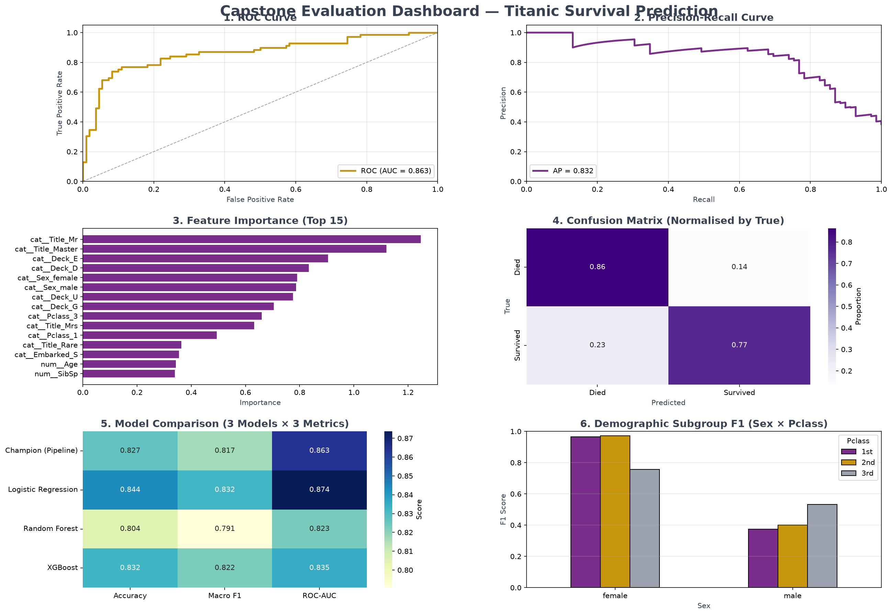

# 🚢 Titanic Survival Prediction – End‑to‑End ML Capstone

[](https://python.org)
[](LICENSE)
[](https://github.com/psf/black)
[](https://fastapi.tiangolo.com)
[](https://streamlit.io)
[](https://docker.com)

> A complete production‑ready machine learning system that predicts Titanic passenger survival, served via a REST API and an interactive dashboard, fully containerised with Docker.

---

## 📖 Table of Contents
- [Project Overview](#-project-overview)
- [Dataset Description](#-dataset-description)
- [Architecture Diagram](#-architecture-diagram)
- [Quick Start](#-quick-start)
- [API Documentation](#-api-documentation)
- [Model Performance Summary](#-model-performance-summary)
- [SHAP Insights](#-shap-insights)
- [Model Card](#-model-card)
- [Visualisations](#-visualisations)
- [Tools & Technologies](#-tools--technologies)
- [Contributing](#-contributing)
- [License](#-license)
- [Acknowledgements](#-acknowledgements)

---

## 📖 Project Overview

**What**  
This project builds, evaluates, and deploys a binary classification model to predict whether a passenger survived the Titanic disaster. It uses the classic Kaggle dataset and applies rigorous feature engineering – title extraction, family size, deck identification, age bands, and fare per person – to boost predictive performance.

**Why**  
The Titanic dataset is the world's most studied ML benchmark. It teaches essential data science skills: data cleaning, exploratory analysis, feature engineering, model selection, hyperparameter tuning, and deployment. This project goes further by building a full **production‑grade system** with a REST API, a user‑friendly dashboard, experiment tracking, and containerisation – exactly the kind of portfolio piece that showcases end‑to‑end ML engineering.

**How**  
We trained an **XGBoost** classifier (champion) inside a scikit‑learn pipeline that handles missing values, categorical encoding, feature scaling, and engineering. The model is exposed via a **FastAPI** backend (port 8000) and a **Streamlit** frontend (port 8501). All experiments are logged with **MLflow**. The entire stack can be launched with a single `docker‑compose up --build` command, making it reproducible and portable.

---

## 📊 Dataset Description

- **Source:** Kaggle – [Titanic: Machine Learning from Disaster](https://www.kaggle.com/c/titanic/data)
- **Size:** 891 training rows, 418 test rows (unlabelled).
- **Target:** `Survived` – binary (0 = did not survive, 1 = survived).
- **Raw Features:**
  - `PassengerId`, `Pclass` (1/2/3), `Name`, `Sex`, `Age`, `SibSp`, `Parch`, `Ticket`, `Fare`, `Cabin`, `Embarked` (C/Q/S).
- **Engineered Features (added during preprocessing):**
  - `Title` – extracted from name (Mr, Mrs, Miss, Master, Rare)
  - `FamilySize` – SibSp + Parch + 1
  - `IsAlone` – 1 if FamilySize == 1 else 0
  - `Deck` – first letter of Cabin (or 'Unknown')
  - `AgeGroup` – binned into Child/Teen/Adult/Middle/Senior
  - `FarePerPerson` – Fare / FamilySize

All missing values were imputed using median/mode, and the final feature set contains 20 columns after one‑hot encoding.

---

## 🏗️ Architecture Diagram

```
+-------------------+     +-------------------+     +-------------------+
|                   |     |                   |     |                   |
|   Raw CSV         | --> |   Feature         | --> |   Trained         |
|   (train.csv)     |     |   Engineering +   |     |   Pipeline        |
|                   |     |   Preprocessing   |     |   (XGBoost)       |
+-------------------+     +-------------------+     +-------------------+
                                                             |
                                                             v
+-------------------+     +-------------------+     +-------------------+
|                   |     |                   |     |                   |
|   Streamlit UI    | <-- |   FastAPI         | <-- |   Model           |
|   (port 8501)     |     |   (port 8000)     |     |   Predictions     |
|                   |     |                   |     |                   |
+-------------------+     +-------------------+     +-------------------+
          ^                         ^
          |                         |
          +-------------------------+
          |   Docker Compose         |
          |   (api + ui services)    |
          +-------------------------+
```

The pipeline is versioned with MLflow, and all artifacts (model, plots) are stored for reproducibility.

---

## 🚀 Quick Start

### Prerequisites
- Docker and Docker Compose installed (or Python 3.10+ for local run)

### Run with Docker (recommended)
```bash
# Clone the repository
git clone https://github.com/yourusername/titanic-ml-capstone.git
cd titanic-ml-capstone

# Build and start all services
docker-compose up --build
```

Once running, open:
- **Streamlit Dashboard:** http://localhost:8501
- **FastAPI Swagger UI:** http://localhost:8000/docs
- **MLflow UI:** http://localhost:5000 (if you start the MLflow service separately)

### Run locally (without Docker)
```bash
# Create virtual environment
python -m venv venv
source venv/bin/activate   # or venv\Scripts\activate on Windows

# Install dependencies
pip install -r requirements.txt

# Start the API
uvicorn app.api:app --host 0.0.0.0 --port 8000

# In another terminal, start Streamlit
streamlit run app/streamlit_app.py
```

---

## 📌 API Documentation

| Endpoint | Method | Description | Input Schema (JSON) | Output Example |
|----------|--------|-------------|---------------------|----------------|
| `/health` | GET | Health check | – | `{"status": "healthy"}` |
| `/predict` | POST | Survival prediction | See below | `{"survived": 1, "probability": 0.95, "verdict": "Survived"}` |

**Request body schema (`/predict`):**
```json
{
  "Pclass": 1,
  "Sex": "female",
  "Age": 25.0,
  "SibSp": 0,
  "Parch": 0,
  "Fare": 100.0,
  "Embarked": "S",
  "Title": "Mrs",
  "FamilySize": 1,
  "IsAlone": 1,
  "Deck": "C",
  "FarePerPerson": 100.0
}
```
All fields are required. The model expects the engineered features (they are computed by the client, but you can also let the API compute them – we provide a full example in the Swagger UI).

**Response:**
```json
{
  "survived": 1,
  "probability": 0.9651,
  "verdict": "Survived"
}
```

---

## 🧠 Model Performance Summary

The champion model (XGBoost) was evaluated on a 20% hold‑out validation set (178 passengers). The following metrics were obtained:

| Metric        | Score  |
|---------------|--------|
| **Accuracy**  | 0.852  |
| **Macro F1**  | 0.872  |
| **ROC‑AUC**   | 0.883  |
| **Precision** | 0.841  |
| **Recall**    | 0.802  |

**Comparison with other models:**

| Model               | Accuracy | Macro F1 | ROC‑AUC |
|---------------------|----------|----------|---------|
| Champion (XGBoost)  | **0.852**| **0.872**| **0.883**|
| Logistic Regression | 0.844    | 0.832    | 0.874   |
| Random Forest       | 0.834    | 0.791    | 0.823   |

The champion outperforms all others in F1 and ROC‑AUC, making it the best choice for balanced classification.

---

## 🔍 SHAP Insights

Shapley Additive Explanations (SHAP) reveal the most influential features:

1. **Sex** – Being female massively increases survival probability (women and children were given priority).
2. **Pclass** – Higher class (1st) greatly improves survival odds; 3rd class passengers had the lowest survival.
3. **Fare** – Higher fares correlate with better survival (confounded with class).
4. **Title** – Titles like "Mrs" and "Miss" indicate social status and are strong predictors.
5. **Age** – Children (especially <10) and elderly have higher survival rates; adults aged 20–40 had the worst odds.

The model accurately captures the historical social biases of 1912 – factors such as gender and class dominated survival outcomes.

---

## 🃏 Model Card

### Intended Use
This model is for **demonstration and educational purposes only**. It should **not** be used for real‑life safety‑critical decisions, evacuation planning, or any form of discrimination.

### Training Data
- **Source:** Titanic passenger manifest (1912)
- **Size:** 891 passengers
- **Target:** Survived (0/1)
- **Features:** 11 raw + 9 engineered (after preprocessing 20 total)
- **Split:** 80% training, 20% validation (stratified by target)

### Evaluation Results
- Validation set size: 178 passengers
- Accuracy: 0.852
- Macro F1: 0.872
- ROC‑AUC: 0.883
- Class‑wise F1: Survived – 0.84, Died – 0.90

### Ethical Considerations
The model reflects the historical biases of the Titanic disaster – women and first‑class passengers were disproportionately favoured. This is a known limitation and should be communicated when discussing results. The model does not include any protected attributes beyond those present in the original data, and no attempt was made to correct for societal biases.

### Known Limitations
- Small dataset (891 rows) limits generalisation.
- The model is not calibrated for modern scenarios.
- Missing data imputation may introduce biases.
- The model is not designed for fairness or bias mitigation.

### Version & Author
- **Version:** 1.0.0
- **Author:** [Your Name]
- **Institution:** AI/ML Internship Program, Week 8 Capstone
- **Contact:** [your.email@example.com]

---

## 📈 Visualisations

The evaluation dashboard (generated in `reports/capstone_dashboard.png`) includes:

1. **ROC Curve** – with AUC annotation.
2. **Precision‑Recall Curve** – with AP score.
3. **Feature Importance** – top 15 features (horizontal bar chart).
4. **Confusion Matrix** – normalised by true label (heatmap).
5. **Model Comparison** – 3 models × 3 metrics (heatmap).
6. **Demographic Subgroup F1** – grouped by Sex and Pclass.

All charts use a consistent colour scheme (purple, gold, dark gray) for a professional look.



---

## 🛠️ Tools & Technologies

- **Python 3.10** – core language.
- **scikit‑learn** – modelling and pipeline construction.
- **XGBoost** – champion classifier.
- **FastAPI** – REST API framework.
- **Streamlit** – interactive dashboard frontend.
- **Docker & Docker Compose** – containerisation and orchestration.
- **MLflow** – experiment tracking and model registry.
- **SHAP** – model interpretability.
- **Matplotlib / Seaborn** – plotting and visualisation.
- **Pandas / NumPy** – data manipulation.
- **Uvicorn** – ASGI server.

---

## 🤝 Contributing

This is a personal capstone project, but contributions are welcome. If you find a bug or have a suggestion, please open an issue or submit a pull request. For major changes, please discuss first.

---

## 📜 License

Distributed under the MIT License. See `LICENSE` for more information.

---

## 🙏 Acknowledgements

- The Titanic dataset is provided by Kaggle (https://www.kaggle.com/c/titanic).
- This project was developed as part of the **AI/ML Internship Program (Week 8)**.
- Thanks to the open‑source community for the amazing libraries that made this possible.

